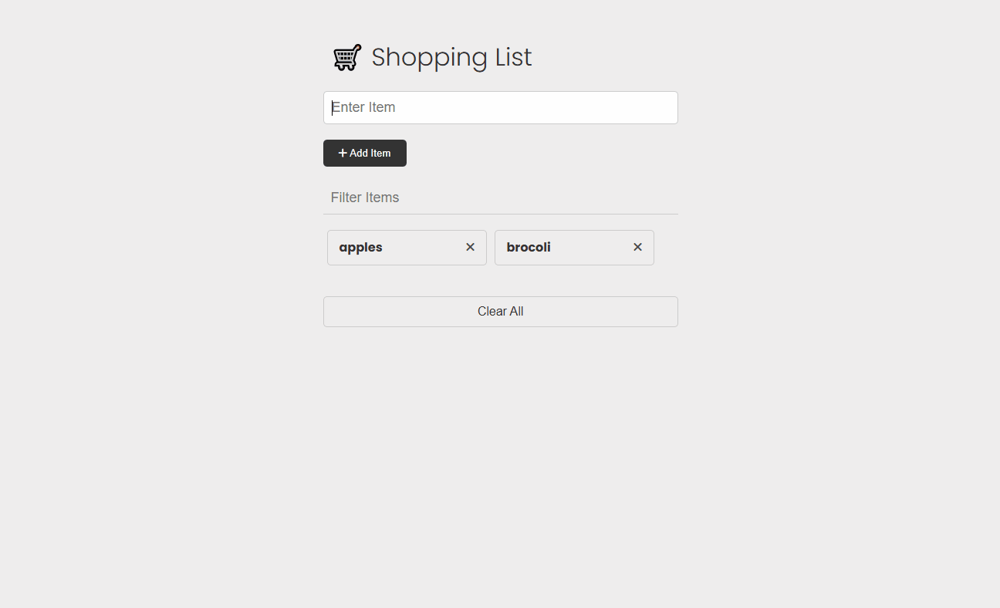

# Shopping List

A simple shopping list web app built with **vanilla JavaScript** to practice working with the **DOM, events, state, local storage and other fundamentals** of the language.

The user can add items to the list, filter existing items, edit them, remove them, and clear all items. The list of items is saved as an object in local storage so that they aren't lost when reloading or reopening the page.

The app features a simple light-theme design that is still readable and easy on the eyes thanks to the light gray background.

[You can check it out here!](https://tangerine-pithivier-bccaac.netlify.app/)

